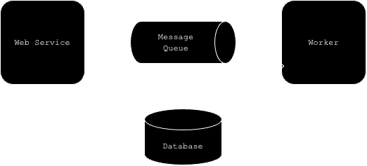
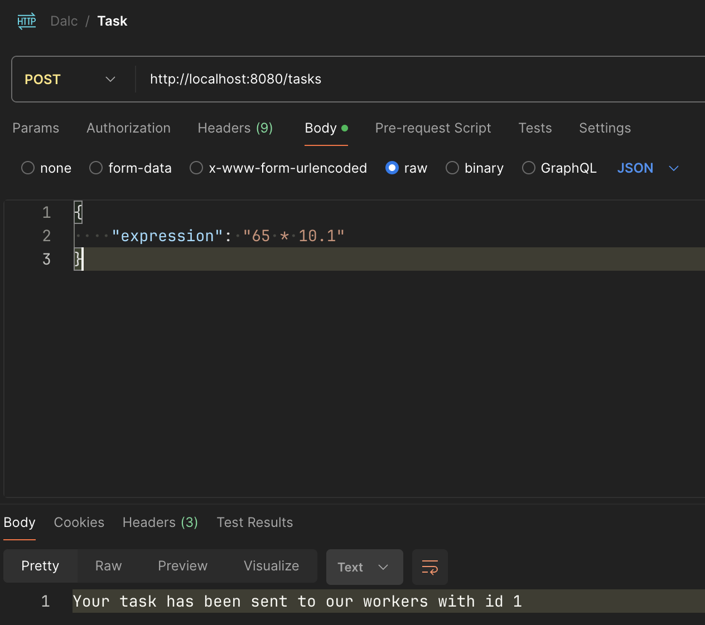
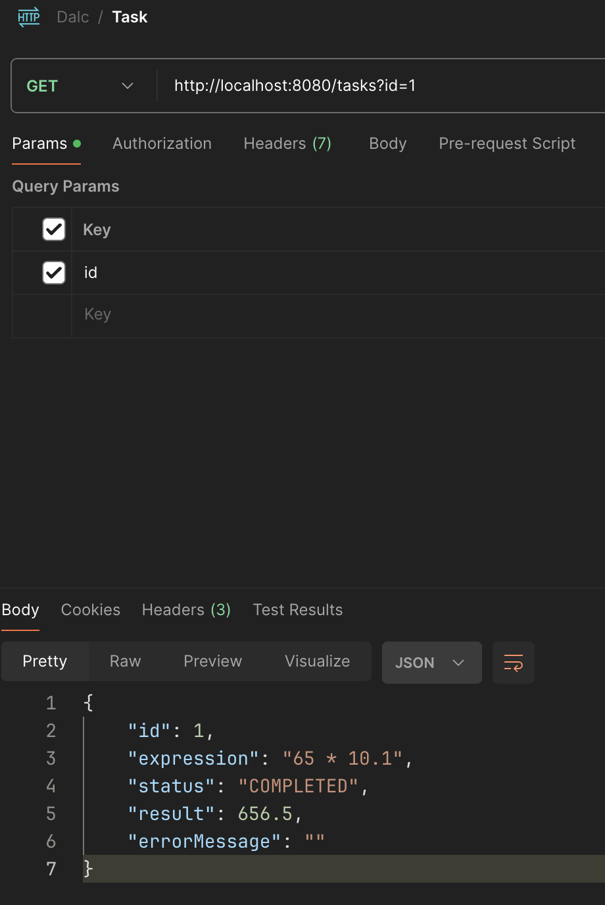

# DALC
**dalc** is a simple distributed calculator service. It distributes it calculation processes to the workers. Meaning the calculation process happens asynchrounously.

These are dalc components:
1. Web services
2. Workers
3. Message Queues
4. Database

The web service is responsible for creating calculation task and sends it to its workers. The web service is then also responsible to retrieve the calculation result alongside its task's minimal metadata.

The worker on the other hand, is responsible to do the calculations. It receives tasks and calculates the given expression in the task. Once the task has been processed, it updates to the database what the result may be, it could either be SUCCESSFUL or FAILED.

Trivially, message queues and database are responsible for delivering task from web service to the worker and saving of tasks and results, respectively.

A simple architecture of dalc is the following:



## What is this project for?
In short, I am interested in Distributed Systems. Hence, I made dalc for me to apply a simple use case of distributed system (work queues model) using ***RabbitMQ***. On top of that, this project is also for me to learn ***Kubernetes***. Lastly, this project will showcases ***traces monitoring*** in distributed systems.

## Deploying with k8s
#### Prequisuite:
1. GNUMake

Here we are going to deploy all dalc components using k8s with the help of [kind](https://kind.sigs.k8s.io/). In this repo, I have provided a Makefile which should make it easy to deploy dalc. In this repo too, I have provided the `k8s` folder which stores all the yaml files for dalc.
1. Firstly, we have to prepare our kind cluster. To do that, we can utilize Makefile provided by:
```shell
make create-cluster
```
This will create a kind cluter using the `kind-cluster.yaml` configuration.

2. Once that is done, we can go ahead and create our k8s cluster using
```shell
make deploy
```
which should output
```shell
kubectl apply -f k8s
configmap/dalc created
configmap/postgres created
statefulset.apps/postgres created
service/postgres created
configmap/rabbitmq-config created
statefulset.apps/rabbitmq created
role.rbac.authorization.k8s.io/rabbitmq-peer-discovery-rbac created
rolebinding.rbac.authorization.k8s.io/rabbitmq-peer-discovery-rbac created
service/rabbitmq created
secret/dalc created
deployment.apps/server created
service/server created
deployment.apps/worker created
```
You should now wait for several second to minutes for all the components to start.

3. After deploying, you can checking the pods status by
```shell
kubectl get pods
```
If the output looks like
```shell
NAME                      READY   STATUS             RESTARTS      AGE
postgres-0                0/1     Init:0/1           0             48s
rabbitmq-0                0/1     Running            0             48s
server-7d79f8ffbd-8swwj   0/1     CrashLoopBackOff   2 (22s ago)   48s
worker-594599f46f-k4mvm   0/1     CrashLoopBackOff   2 (15s ago)   47s
```
that means the components are not ready yet. After some time, the output should be the following
```shell
NAME                      READY   STATUS    RESTARTS        AGE
postgres-0                1/1     Running   0               5m30s
rabbitmq-0                1/1     Running   0               5m30s
rabbitmq-1                1/1     Running   0               4m28s
rabbitmq-2                1/1     Running   0               3m27s
server-7d79f8ffbd-8swwj   1/1     Running   4 (4m35s ago)   5m30s
worker-594599f46f-k4mvm   1/1     Running   4 (4m30s ago)   5m29s
```
where every components are `Running` and most importantly the server and worker components are running. If for some reason, you cannot achieve the above states, please raise an issue.

That's it, you're done. You could now try to use dalc.

## Trying dalc
1. Open your client of choice, I'll be using Postman and head to `POST http://localhost:8080/tasks`, enter the body like the following:
```json
{
    "expression": "1 + 1"
}
```
You will receive like the following



2. To view your result, you'll need to head to `GET http://localhost:8080/tasks?id=1` and you'll receive



There it is. That's **dalc**. Simple but a fun one.

## Shutting down dalc
Once you're bored with **dalc** 🤣, you can shut it down by simply running `make teardown`. This will stop dalc and clean it.

## Things to do:
- [x] Use RabbitMQ as the message queue 
- [x] Use Kubernetes to deploy dalc
- [ ] Add Opentelemetry and use Jaeger to display trace
